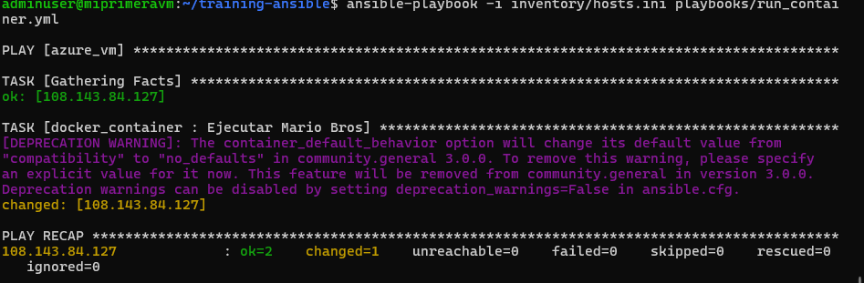
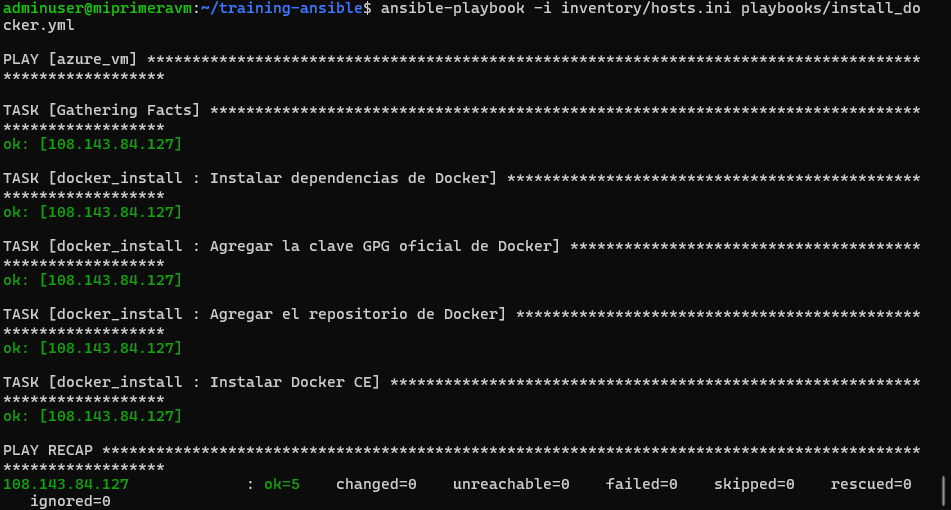
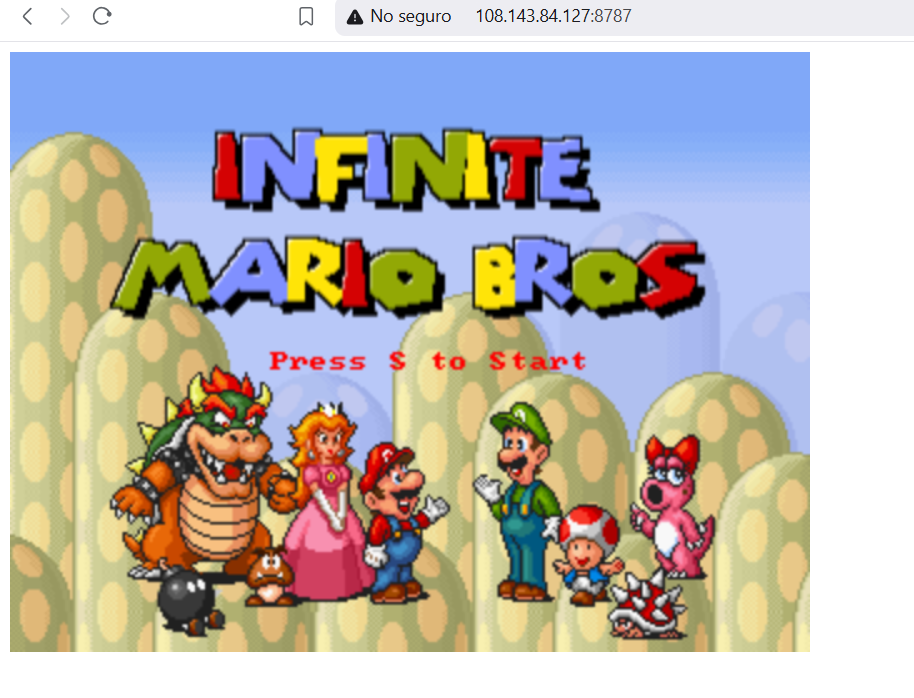

# Despliegue Automatizado de Docker y Mario Bros con Ansible

Este proyecto utiliza **Ansible** para automatizar la instalación de **Docker** y el despliegue de un contenedor con el juego **Mario Bros** en una máquina virtual remota en **Azure**.

## 📂 Estructura del Proyecto

```
training-ansible/
├── inventory/
│   └── hosts.ini             # Archivo con la IP de la VM
├── playbooks/
│   ├── install_docker.yml    # Playbook para instalar Docker
│   ├── run_container.yml     # Playbook para ejecutar Mario Bros
├── roles/
│   ├── docker_install/
│   │   └── tasks/
│   │       └── main.yml      # Instalación de Docker
│   ├── docker_container/
│       └── tasks/
│           └── main.yml      # Ejecución del contenedor
└── ansible.cfg               # Configuración de Ansible
```

---

## 🖥️ Configuración de la Máquina Virtual

En el archivo `inventory/hosts.ini`, se define la VM donde se ejecutarán los playbooks:

```ini
[azure_vm]
vm_ip ansible_user=admin ansible_ssh_pass=pass
```

📌 **Nota**: `vm_ip` debe reemplazarse con la dirección IP real de la VM.

---

## 📦 Instalación de Docker con Ansible

El playbook `install_docker.yml` instala Docker en la VM:

```yaml
- hosts: azure_vm
  become: yes
  roles:
    - docker_install
```

📌 Dentro del rol `docker_install`, se realizan los siguientes pasos:
✅ Instalación de dependencias  
✅ Agregar la clave GPG de Docker  
✅ Configuración del repositorio de Docker  
✅ Instalación del paquete `docker-ce`  

---

## 🎮 Despliegue del Contenedor de Mario Bros

El playbook `run_container.yml` ejecuta el contenedor del juego:

```yaml
- hosts: azure_vm
  become: yes
  roles:
    - docker_container
```

📌 Dentro del rol `docker_container`, se usa el módulo `docker_container` para:
✅ Descargar la imagen `pengbai/docker-supermario:latest`  
✅ Ejecutar el contenedor en el puerto **8787**  

---

## 🚀 Ejecución de los Playbooks

Para ejecutar los playbooks, se usaron los siguientes comandos:

### 1️⃣ Instalar Docker en la VM
```bash
ansible-playbook -i inventory/hosts.ini playbooks/install_docker.yml
```

### 2️⃣ Ejecutar el contenedor de Mario Bros
```bash
ansible-playbook -i inventory/hosts.ini playbooks/run_container.yml
```

---

## 🔒 Configuración de Seguridad en Azure

Para acceder al juego, se configuró una **regla de seguridad** en Azure para permitir tráfico en el puerto **8787**:

```hcl
security_rule {
    name                       = "mario_bros_rule"
    priority                   = 110
    direction                  = "Inbound"
    access                     = "Allow"
    protocol                   = "Tcp"
    source_port_range          = "*"
    destination_port_range     = "8787"
    source_address_prefix      = "*"
    destination_address_prefix = "*"
}
```

---

## 🌍 Acceder al Juego

Una vez que el contenedor está en ejecución y la regla de seguridad está configurada, se puede acceder al juego desde un navegador web con la URL:

```
http://<VM_IP>:8787
```

🎮 **¡Listo! Ahora puedes jugar Mario Bros en tu máquina virtual desplegada con Ansible.** 🚀


